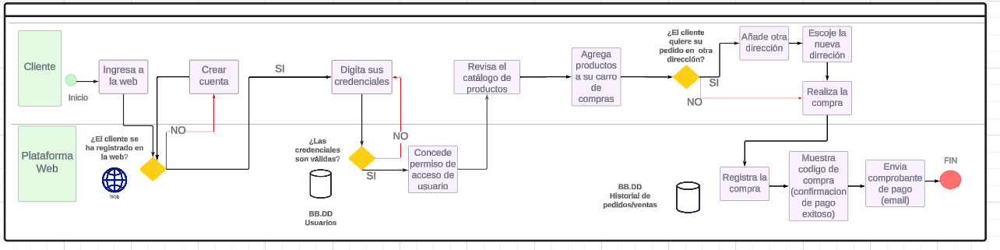

# AS IS
## Como actualmente se realiza

| Secuencia | Actividad                                | Descripción                                                                                                      | Responsable      |
|-----------|------------------------------------------|------------------------------------------------------------------------------------------------------------------|------------------|
| 1         | Cliente contacta a la empresa           | El cliente se comunica con la empresa a través de llamadas telefónicas o correos electrónicos.                  | Gestor de Ventas |
| 2         | Realizar pedido                          | El cliente proporciona los detalles del pedido (productos, cantidades, etc.) durante la comunicación con la empresa. | Gestor de ventas         |
| 3         | Recepción del pedido                    | Un empleado de ventas registra manualmente el pedido del cliente en los registros de la empresa.                 | Gestor de Ventas |
| 4         | Revisión de inventarios                 | Se requiere que un empleado de almacén verifique manualmente la disponibilidad de los productos en inventario e informe la disponibilidad al Gestor de Ventas que está atendiendo al cliente.                   | Gestor de Almacén |
| 5         | Confirmación de pedido al cliente       | Un empleado de ventas confirma el pedido al cliente a través de llamadas telefónicas o correos electrónicos.     | Gestor de Ventas |
| 6         | Elección de método de pago              | Se discute con el cliente los métodos de pago disponibles durante la comunicación.                                | Gestor de Ventas |
| 7         | Realizar el pago                        | El cliente realiza el pago a través de los métodos de pago acordados, como transferencia bancaria o depósito en efectivo. | Gestor de Ventas         |
| 8        | Confirmación de pago                    | Un empleado de ventas verifica manualmente el pago recibido y actualiza el estado del pedido en los registros.    | Gestor de Ventas |
| 9        | Envío de código de compra               | Se genera manualmente un código de compra único y se envía al cliente por correo electrónico.                    | Gestor de Ventas |
| 10      | Emitir comprobante de pago electrónico | Se genera manualmente un comprobante de pago y se envía al cliente por correo electrónico.                      | Gestor de Ventas |

# TO BE
## Cambios que se implementarán
1) Se implementará la pagina web que permite realizar **log in**. Los usuarios podrán hacer sus **pedidos** directamente en el **sitio web**.
2) Para crear su cuenta se le pedirá al usuario que añada sus datos personales, así como su dirreción actual para asi poder tenerlo en cuenta a la hora de
   realizar el envío de pedidos. En caso contrario, puede añadir otra dirección por si quiere que los pedidos lleguen a esa nueva dirección. Esto
   evita estar haciendo coordinaciones previas y lo hace más dinámico.
4) De la misma forma, el usuario elige sus **metodos de pago** en la **plataforma web**. Se cuenta por ahora, con pagos por tarjeta de crédito y débito.
5) Los clientes pueden acceder a su **carro de compras** donde podrán encontrar información sobre su producto. A travez del catalogo se puede añadir los
   productos al carro de compras.
6) La **emision de comprobante de pago** ya no será manual. La misma página los puede enviar.

 [Regresar al Entregable 3](../../04.Entregables/Entregable3/entregable3.md)

  [Regresar al índice](../../README.md)
