## 1. Descripción de la Empresa, del Proceso de Negocio Elegido y Motivación
### 1.1 Datos de la empresa
- Descripción de la empresa: Es una microempresa que vende maquillaje y papelería que busca traer productos de buena calidad y buen precio, sus principales productos son maquillaje, lapiceros, cuadernos.

- RUC:
- Razón social:
- Dirección:
- Teléfono:
- Misión: Nuestra misión es ser un referente en el mercado por la diversidad y calidad de nuestros productos en papelería y maquillaje. Buscamos ofrecer una orientación personalizada a nuestros clientes para encontrar los productos que mejor se adapten a sus gustos con la única finalidad de satisfacerlos.💗✨
- Visión: Nuestra visión es ser reconocidos como el espacio preferido para aquellos que buscan una experiencia de compra excepcional en el mundo del maquillaje y la papelería por lo que nos esforzamos por crear un ambiente acogedor y emocionante, donde los clientes puedan explorar una amplia diversidad de productos y recibir asesoramiento personalizado por parte de nuestro equipo capacitado. Es así que aspiramos establecer relaciones sólidas y duraderas con nuestros clientes, basadas en la confianza, la satisfacción y la lealtad hacia nuestro servicio por eso es que nos innovaremos constantemente para mantenernos a la vanguardia de las tendencias y necesidades de nuestros público, sin descuidar la dedicación y calidad procurada. 💗
- Productos ofrecidos:
  - Papelería:
    - Cuadernos
    - Lapiceros
  - Maquillaje
    - Paletas
    - Rubores
    - Primers
    - Polvos y correctores
    - Glitter
    - Delineadores de ojos y labios
    - Labiales y glosses
    - Máscaras de pestañas
### 1.2 Descripción del proceso de negocio

- Proceso de compra - Este proceso se refiere a las compras de los diversos productos para el almacén de la empresa y poder venderlos.
- Proceso de venta - Este proceso es acerca de los procesos de venta en la empresa que inicia desde que el cliente nos contacta para venderle el producto.
- Proceso de almacen - Este proceso se refiere a cómo se gestiona el almacén de manera que constatemente se verifica el stock de los productos.
- Proceso de distribucion - Este proceso se refiere a las actividades que abarcan llevar el producto hasta el cliente.
- Proceso de marketing - Este proceso es acerca de las actividades que realizan para llamar al cliente.
- Proceso de finanzas - Este proceso abarca las diversas actividades en que se gestionan las ganancias y perdidas en base a las compras, los gastos y las ventas.
- Proceso de CRM - Este proceso abarca las actividades para mapear a los clientes y saber mejor sus necesidades.

### PROCESO AS IS

- Proceso de Compra

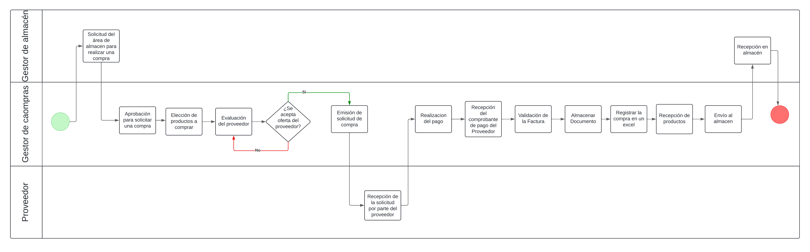

- Proceso de Venta

| Secuencia | Actividad                                | Descripción                                                                                                      | Responsable      |
|-----------|------------------------------------------|------------------------------------------------------------------------------------------------------------------|------------------|
| 1         | Cliente contacta a la empresa           | El cliente se comunica con la empresa a través de llamadas telefónicas o correos electrónicos.                  | Gestor de Ventas |
| 2         | Realizar pedido                          | El cliente proporciona los detalles del pedido (productos, cantidades, etc.) durante la comunicación con la empresa. | Gestor de ventas         |
| 3         | Recepción del pedido                    | Un empleado de ventas registra manualmente el pedido del cliente en los registros de la empresa.                 | Gestor de Ventas |
| 4         | Revisión de inventarios                 | Se requiere que un empleado de almacén verifique manualmente la disponibilidad de los productos en inventario e informe la disponibilidad al Gestor de Ventas que está atendiendo al cliente.                   | Gestor de Almacén |
| 5         | Confirmación de pedido al cliente       | Un empleado de ventas confirma el pedido al cliente a través de llamadas telefónicas o correos electrónicos.     | Gestor de Ventas |
| 6         | Elección de método de pago              | Se discute con el cliente los métodos de pago disponibles durante la comunicación.                                | Gestor de Ventas |
| 7         | Realizar el pago                        | El cliente realiza el pago a través de los métodos de pago acordados, como transferencia bancaria o depósito en efectivo. | Gestor de Ventas         |
| 8        | Confirmación de pago                    | Un empleado de ventas verifica manualmente el pago recibido y actualiza el estado del pedido en los registros.    | Gestor de Ventas |
| 9        | Envío de código de compra               | Se genera manualmente un código de compra único y se envía al cliente por correo electrónico.                    | Gestor de Ventas |
| 10      | Emitir comprobante de pago electrónico | Se genera manualmente un comprobante de pago y se envía al cliente por correo electrónico.                      | Gestor de Ventas |
- Proceso de Almacén

| Secuencia | Actividad                                | Descripción                                                                                                      | Responsable      |
|-----------|------------------------------------------|------------------------------------------------------------------------------------------------------------------|------------------|
|1| Buscar Mercancía|Al confirmase una venta, la persona que lo realizó busca los productos en almacén| Gestor de Almacén|
|2| Despachar Mercancía|Se prepara el producto para su entrega en el lugar establecido| Gestor de Almacén|
|3| Registrar Nuevo Stock|Se registra el la cantidad final que queda del producto (conteo rápido)| Gestor de Almacén|
|4| Realizar Cotización de Nuevos Productos|Si el Stock es 0, se cotiza con la lista de proveedores para recibir nueva mercadería| Gestor de Almacén|
|5| Actualizar|Al comprar nueva mercancía, se deja el stock en almacén y se registra la cantidad que se compró| Gestor de Almacén|

- Proceso de Distribución
  
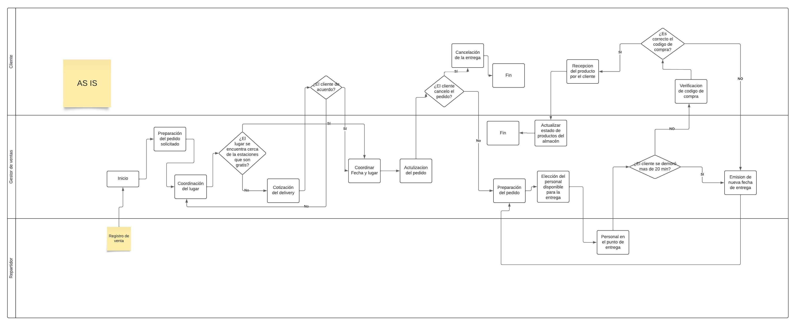

- Proceso de Marketing

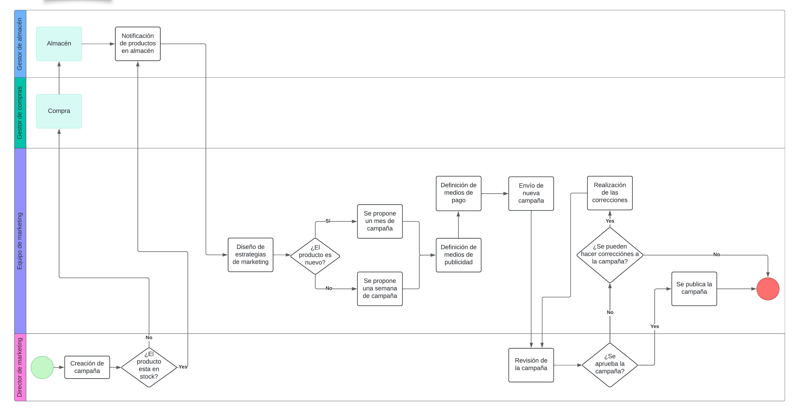

- Proceso de CRM

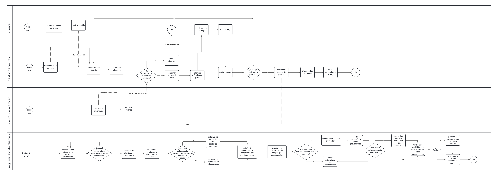

- Proceso de Finanzas

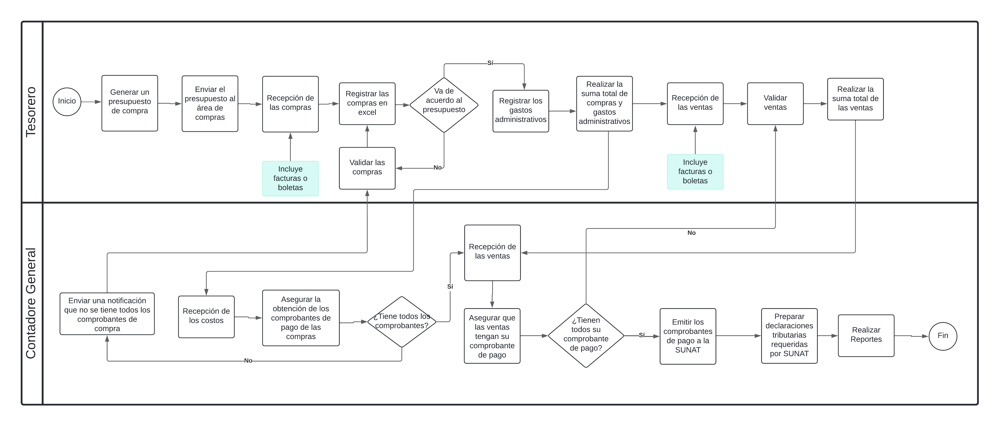

### PROCESO TO BE

- Proceso de Compra

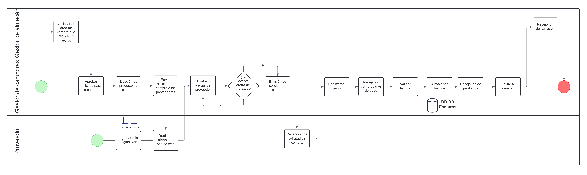

- Proceso de Venta

- Proceso de Almacén

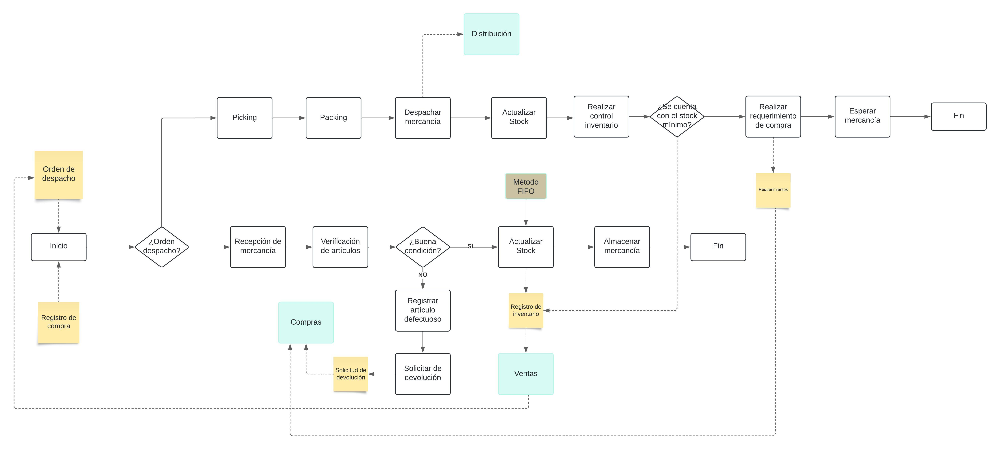
|Secuencia | Actividad | Descripción | Responsable |
|:----:|:----------------:|:--------------------------:|:-----------:|
| 1 | Recepción de la órden de despacho | El área de ventas, al concretar la venta de un producto con el cliente, emitirpa una orden de despacho al área de almacén para que éste pueda preparar la lista de productos para su entrega. | Gestor de Almacén |
| 2 | Picking | El reponsable derivado a la órden de despacho selecciona y recoge los productos de los diferentes lugares del almacén donde se encuentre los productos de la órden. | Personal de almacén |
| 3 | Packing | El reponsable derivado a la órden de despacho empaqueta y embala los productos selecionados garantiznado las condiciones adecuadas para el envío.| Personal de almacén |
| 4 | Despachar Mercancía | Los producto empaquetados son llevados al área de distribución para su respectiva entrega| Personal de almacén |
| 5 | Actualizar stock | En el sistema de almacén se registra la salida del producto (cantidad) con la fecha y hora para la actualización en tiempo real del inventario | Gestor de almacén |
| 6 | Realizar control inventario | Al terminar con la actualización del Stock, el sistema evaluará la condición de que si para el producto ingresado se tiene su stock mínimo; si es así, se genera un reporte de salidas (al final del día) para el registro de inventario que se enviará a Ventas para que tenga la cantidad exacta existente a promocionar. | Gestor de almacén |
| 7 | Realizar requerimiento de compra | Si para los producto despechados no se cuenta con su stock mínimo, el sistema realizará una lista de requerimiento que se enviará al área de compras. | Gestor de almacén |
| 8 | Recepción de mercancía | Si llega un registro de compra de proveedores a almacen, los encargados hará la recepción de la mercancía (descarga del medio de transporte) y marcarán la fecha y hora en que lo hacen como indicador de tiempo. | Gestor Ventas  y Encargado de almacén |
| 9 | Verificar artículos | Verificar el estado de cada artículo comprado para ver si hay defectuosos y proceder a realizar una observación y posible cambio o devolución si se encuentra en ese estado. | Personal de almacén |
| 10 | Actualizar stock | Si el artículo está en buena condición, se registra la cantidad en el sistema con su respectivo código y ubicación de donde se colocará en el almacén para un rápido picking | Gestor de almacén |
| 11 | Almacenar mercanción | El personal distribuirá los articulos según su ubicación correspondiente en los andamios del almacén. | Personal de almacén |
| 12 | Registrar artículo defectuoso | Si se encuentra un producto defectuoso, se registrará en el sistema con las características defectuosa, el proveedor y código del producto. | Gestor de almacén |

- Proceso de Distribución
  
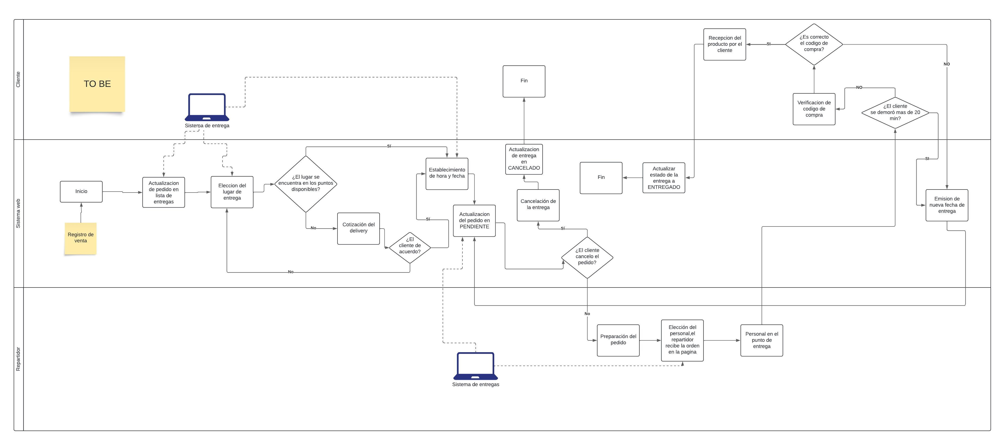

- Proceso de Marketing

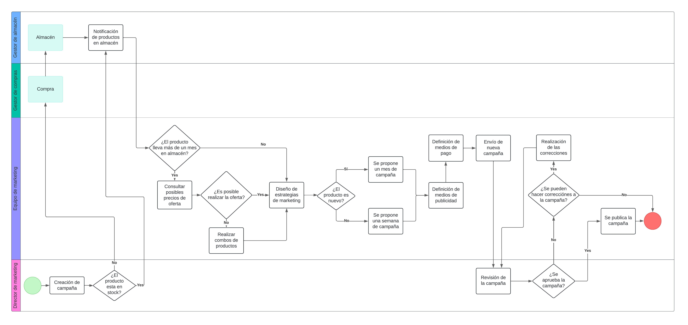

- Proceso de Finanzas

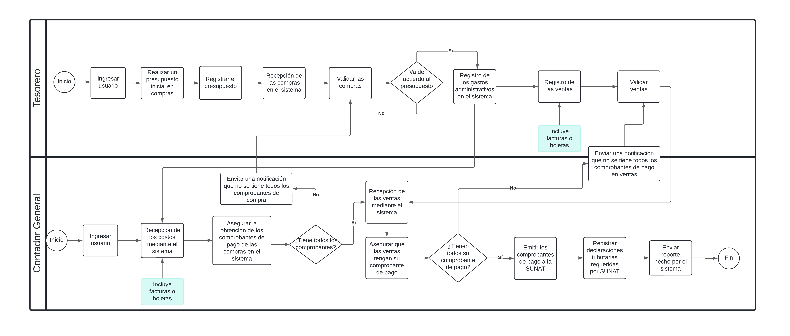

- Proceso de CRM

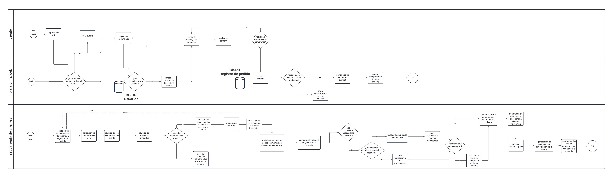

### 1.3 Motivación
-
## 2. Módulos
### 2.1 Módulo 1
### 2.2 Módulo 2
### 2.3 Módulo 3
### 2.4 Módulo 4
### 2.5 Módulo 5
### 2.6 Módulo 6
### 2.7 Módulo 7
## 3. Requerimientos
## 4. Prototipo
- Para ver el prototipo debe ingresar al siguiente enlace:

[Figma](https://www.figma.com/file/JaEtbwPTFhxpp8rVLio8Lc/Proyecto-Migni-Store?type=design&node-id=56-105&mode=design&t=6vRNAXtGiQCHDJhl-0)

## 5. Modelado Conceptual
### 5.1 Diagrama de entidad relación
- Modelo Conceptual

## 6. Modelado Relacional
### 6.1 Modelo Lógico
[Se inserta imagen][o tambien el link]

